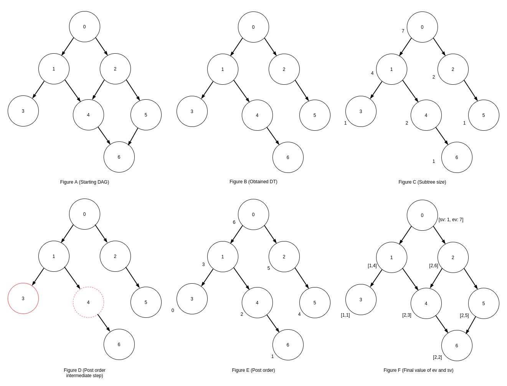

# Parallel DFS for Directed Acyclic Graphs

This is a C++ implementation of a parallel algorithm of the DFS traversal, according to
[this paper](https://research.nvidia.com/publication/parallel-depth-first-search-directed-acyclic-graphs).
The idea under this algorithm is overcoming the problems of parallel implementations of 
the standard DFS-based labelling approach. That's because DFS requires a strict ordering in
edges visitation and the usage of some global variables, which represent a great limitation
whenever there is the need to go parallel.

This algorithm provides an efficient solution for the DFS traversal of directed acyclic graph (DAG)
with no more than 3 BFS visits, which allow to find as result the pre-order, post-order and the 
parent relationship between the nodes of the DAG.

* The first BFS visit is aimed to convert the DAG to a DT (Figure B);
* The next visit is done on the DT and has the role to find, for each 
  node, the subtree size, defined as the number of nodes reachable from it, plus itself (Figure C);
* With the third visit, it is possible to obtain the number of  
  nodes which should be previously visited according to the DFS visitation order, looking at the
  subtree size of the preceding siblings of the current node and preceding siblings of the parents (Figure D).
  Starting from the previously worked out values, we obtain post order and pre order 
  (the latter is not worked out in this implementation, but this can easily be done with very minimal changes to the code) (Figure E).

Note that this implementation has an additional BFS visit on the DAG (Figure F), aimed to compute outer and inner rank, respectively defined as

* post order + 1 (e_v or outer rank)
* equal to the outer rank if the node has no children, the minimum of the outer
  ranks of the children otherwise (s_v or inner rank).

More info (except regarding ranks) in the paper.



## Running

For building the project use the provided `CMakeLists.txt`, with the following
commands

```shell
$ mkdir build && cd build && cmake .. && make && cp parallel-dfs-dag .. && cd ..
```

The program receive a file containing the initial dag with the following format

    <number of nodes>
    0: <node1> <node2> ... #
    ...
    
    <nodeId>: <nodeN> <nodeM> ... #
    
    ...

The initial line contains the number of nodes while all the next lines have the
same format, starting with the (numeric) node identifier (must be incremental)
followed by a colon and the the list of the nodes to which the current node
points to.

For example the DAG of the previous example is represented as

    7
    0: 1 2 #
    1: 3 4 #
    2: 4 5 #
    3: #
    4: 6 #
    5: 6 #
    6: #

The third argument of the executable is the name of the file into which the
ranks are going to be saved, with format:

    node_number sv ev

The following is the content of the output file of the previous example:

    0 1 7
    1 1 4
    2 2 6
    3 1 1
    4 2 3
    5 2 5
    6 2 2